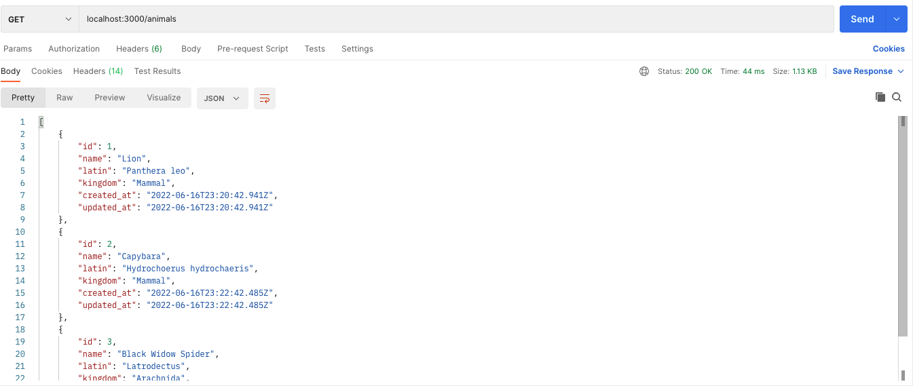
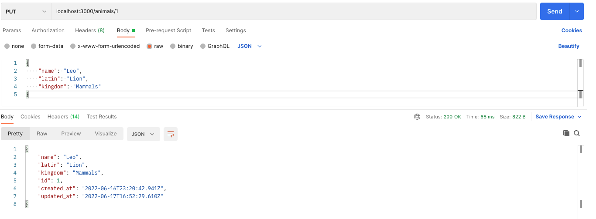
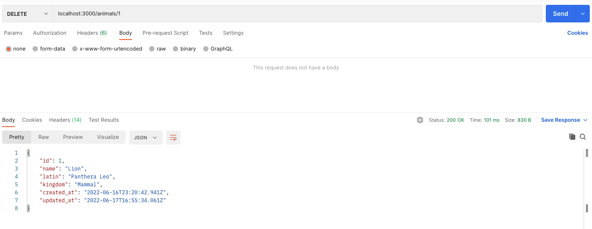
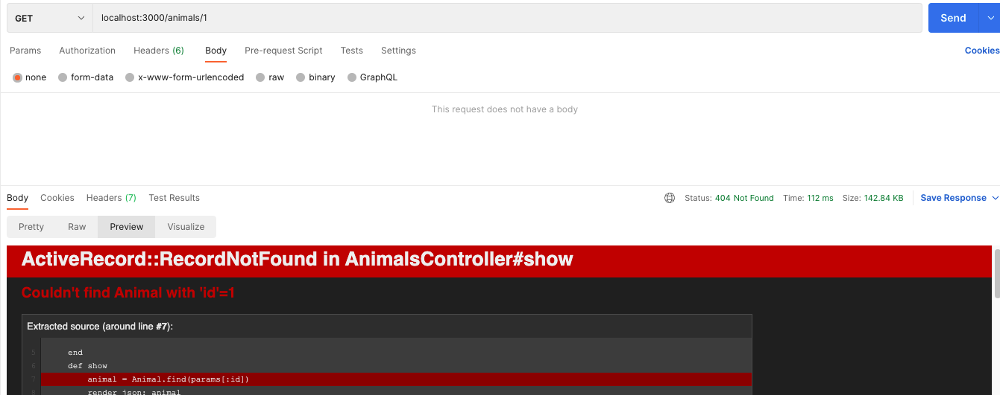
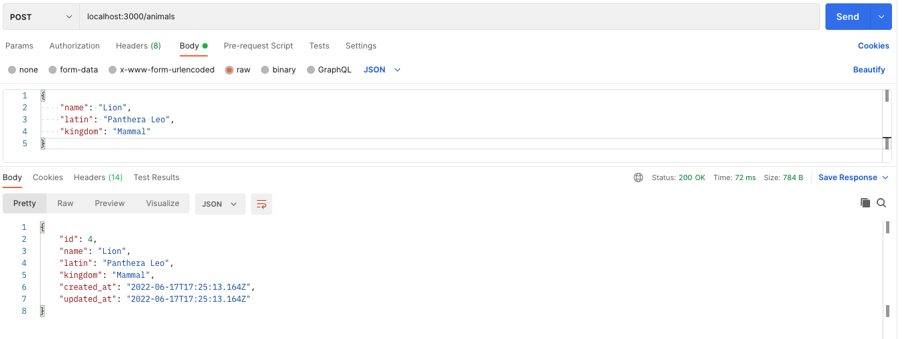

# README

This README would normally document whatever steps are necessary to get the
application up and running.

Things you may want to cover:

* Ruby version

* System dependencies

* Configuration

* Database creation

* Database initialization

* How to run the test suite

* Services (job queues, cache servers, search engines, etc.)

* Deployment instructions

* ...

## RESTful Routes for Databases (no views)
- index
- show
- create
- update
- destroy

## Wildlife Tracker Challenge
The Forest Service is considering a proposal to place in conservancy a forest of virgin Douglas fir just outside of Portland, Oregon. Before they give the go-ahead, they need to do an environmental impact study. They've asked you to build an API the rangers can use to report wildlife sightings.

Story: As a developer I can create an animal model in the database. An animal has the following information: common name, latin name, kingdom (mammal, insect, etc.).  

Created my rails app:
```
$  rails new wildlife_tracker -d postgresql -T
$  rails db:create
$  cd wildlife_tracker
$  rails db:create
$  bundle add rspec-rails
$  rails generate rspec:install
$  rails s
$  code .
$  rails g resource Animal name:string latin:string kingdom:string
$  rails db:migrate
$  rails c
```


Story: As the consumer of the API I can see all the animals in the database.
Hint: Make a few animals using Rails Console

Created some animals for the database:
```Ruby
Animal.create(name:"Lion", latin:"Panthera leo", kingdom:"Mammal")
Animal.create(name:"Capybara", latin:"Hydrochoerus hydrochaeris", kingdom:"Mammal")
Animal.create(name:"Black Widow Spider", latin:"Latrodectus", kingdom:"Arachnida")
```

- Work on Index RESTful route:
```Ruby
    def index
        animals = Animal.all
        render json: animals
    end
```


- Work on show RESTful route:

```Ruby
    def show
        animal = Animal.find(params[:id])
        render json: animal
    end
```


Story: As the consumer of the API I can update an animal in the database.

- Update the controller with the update method:

```Ruby
def update
        animal = Animal.find(params[:id])
        animal.update(animal_params)
       if animal.valid?
         render json: animal
       else
        render json: animal.errors
       end
    end
```
- Make sure to use strong params:
```Ruby
 private
    def animal_params
        params.require(:animal).permit(:name, :latin, :kingdom)
    end
```
- Take note not to put new methods under private or they will not work.

- Update is a put/patch HTTP request, with the .update Controller.
- The terminal (rails routes -E) says my update uri is: /animals/:id(.:format)
- Make sure to use the PATCH or PUT verb
- make sure to use the 'body' tab => raw button => format -JSON for text editor to format the update and pass the specific values for params.
Format below:
```json
{
    "name": "",
    "latin": "",
    "kingdom": "",
}
```
- Got error 422 for Invalid Authenticity Token (GOOD - have to allow it!)
- Go to application controller and put:
```Ruby
    skip_before_action :verify_authenticity_token
```
- Edit primary key 1- URI: localhost:3000/animals/1
- The put request in the body:
```Ruby
{
    "name": "Leo",
    "latin": "Lion",
    "kingdom": "Mammals"
}
```


- Changed the values back to normal after.

Story: As the consumer of the API I can destroy an animal in the database.

- HTTP Verb - DELETE URI - /animals/:id(.:format) Method - animals#destroy
- Update the controller with the destroy method:
```Ruby
def destroy
        animal = Animal.find(params[:id])
        animal.destroy
        if animal.valid?
         render json: animal
       else
        render json: animal.errors
       end
    end
```
- Make sure to switch the verb in postman to delete
- make sure to switch the body back to none (not sure if that is required)





Story: As the consumer of the API I can create a new animal in the database.

- HTTP verb - POST URI - /animals(.:format) Controller Method - animals#create
- Note the 'new' method is not needed because it is a view request
- Update the controller with the create method (already have strong params impletemented):
```Ruby
def create 
        animal = Animal.create(animal_params)
        if animal.valid?
            render json: animal
        else
           render json: animal.errors
        end
    end
```
- Make sure to switch the verb in postman to POST
- make sure to enable the body and fill out the parameters in JSON:
```Json
{
    "name": "Lion",
    "latin": "Panthera Leo",
    "kingdom": "Mammal"
}
```




Story: As the consumer of the API I can create a sighting of an animal with date (use the datetime datatype), a latitude, and a longitude.
Hint: An animal has_many sightings. (rails g resource Sighting animal_id:integer ...)
Hint: Datetime is written in Rails as “year-month-day hr:min:sec" (“2022-01-28 05:40:30")

- Create a new table(generate resource) for Sighting. it has date(datetime): "2022-01-28-05:40:30", lat(decimal):-90 - +90, long(decimal): -180 - 180. lat and long have a maximum of 8 decimal places for precision [stackoverflow decimals](https://stackoverflow.com/questions/15965166/what-are-the-lengths-of-location-coordinates-latitude-and-longitude#:~:text=The%20valid%20range%20of%20latitude,of%20the%20Prime%20Meridian%2C%20respectively.)

- the Sighting model is associated with the Animal model. (Sighting belongs_to Animal; Animal has_many Sightings)

- Use foreign keys to associate the Sighting model. animal_id: integer

```
$ rails g resource Sighting date:datetime lat:decimal long:decimal
```

```Ruby
class Animal < ApplicationRecord
    has_many :sightings
end

class Sighting < ApplicationRecord
    belongs_to :animal
end
```
```
$ rails db:migrate
```

- Forgot to add animal_id: integer for the foreign key association!
- Have to generate another migration to add a column
```Ruby
class AddAnimalIdToSighting < ActiveRecord::Migration[7.0]
  def change
    add_column :sightings, :animal_id, :integer
  end
end
```
```
$ rails db:migrate
```

- To create a sighting of an animal: 


Story: As the consumer of the API I can update an animal sighting in the database.

Story: As the consumer of the API I can destroy an animal sighting in the database.

Story: As the consumer of the API, when I view a specific animal, I can also see a list sightings of that animal.

Hint: Checkout the Ruby on Rails API docs on how to include associations.

Story: As the consumer of the API, I can run a report to list all sightings during a given time period.
Hint: Your controller can look like this:

```Ruby
class SightingsController < ApplicationController
  def index
    sightings = Sighting.where(date: params[:start_date]..params[:end_date])
    render json: sightings
  end
end
```
Remember to add the start_date and end_date to what is permitted in your strong parameters method. In Postman, you will want to utilize the params section to get the correct data. Also see Routes with Params .

Stretch Challenges
Note: All of these stories should include the proper RSpec tests. Validations will require specs in spec/models, and the controller method will require specs in spec/requests.

Story: As the consumer of the API, I want to see validation errors if a sighting doesn't include: latitude, longitude, or a date.

Story: As the consumer of the API, I want to see validation errors if an animal doesn't include a common name, or a latin name.

Story: As the consumer of the API, I want to see a validation error if the animals latin name matches exactly the common name.

Story: As the consumer of the API, I want to see a validation error if the animals latin name or common name are not unique.

Story: As the consumer, I want to see a status code of 422 when a post request can not be completed because of validation errors.
Check out Handling Errors in an API Application the Rails Way

Super Stretch Challenge
Story: As the consumer of the API, I can submit sighting data along with a new animal in a single API call.
Hint: Look into accepts_nested_attributes_for

